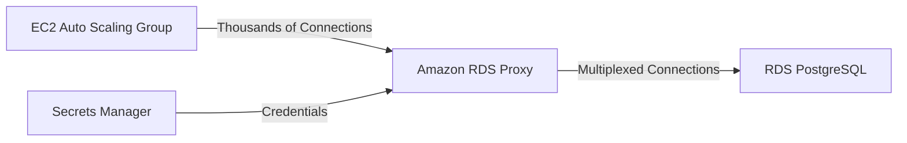

# Keystone Nexus - Database Architecture

## 🛡️ Amazon RDS Proxy: Connection Pooling Strategy

### Problem Statement (Deficiency)
While the analytical workload leverages serverless S3/Athena, the **operational state** (e.g., active shipment tracking, inventory status) resides in **Amazon RDS PostgreSQL**.

In high-throughput scenarios, particularly when the EC2 Auto Scaling Group spins up dozens of Python workers to handle ingestion spikes (e.g., Black Friday traffic), thousands of concurrent database connections can be opened. This creates a risk of **"Connection Storms"** that can exhaust the database's `max_connections` limit, causing service outages even if CPU/Memory utilization is low.

### Solution: Amazon RDS Proxy
To mitigate this risk, **Amazon RDS Proxy** is deployed as an intermediary between the application tier (Lambda/EC2) and the database tier.

### 🏗️ Architecture Implementation



### Key Benefits
1.  **Connection Multiplexing:** RDS Proxy shares a small pool of database connections among thousands of application instances. This allows the application to scale without overwhelming the DB.
2.  **Failover Resilience:** The proxy automatically routes traffic to a standby instance during failover, reducing downtime from ~30s to <1s.
3.  **Security:** Enforces IAM authentication and TLS encryption without requiring code changes in the application.

### Configuration
The proxy is configured via `infra/rds/proxy_config.json`:
- **Engine:** PostgreSQL
- **Auth Scheme:** AWS Secrets Manager (No hardcoded passwords)
- **TLS:** Mandatory encryption
- **Idle Timeout:** 30 minutes

### Deployment Command
```bash
aws rds create-db-proxy --cli-input-json file://infra/rds/proxy_config.json
```

---
**Status:** Configuration defined and documented. Ready for deployment.
