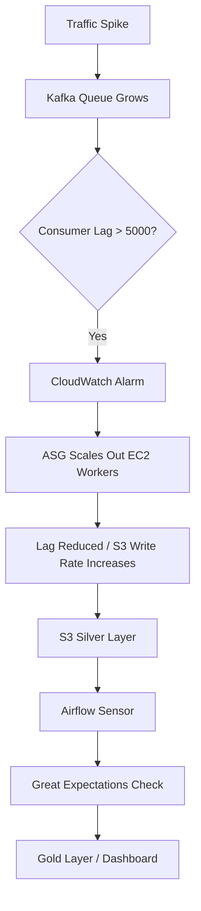

# Keystone Nexus - Resilience Strategy

## 🛡️ Auto Scaling & Orchestration Architecture

### Problem Statement (Deficiency)
E-commerce traffic is inherently bursty (e.g., Black Friday, Flash Sales). A static fleet of EC2 worker nodes for Kafka consumption leads to two failure modes:
1.  **Over-provisioning:** Wasted compute costs during off-peak hours.
2.  **Under-provisioning:** Ingestion lag grows uncontrollably during spikes, delaying analytical insights.

### Solution 1: AWS Auto Scaling Groups (Compute Elasticity)
We implement an **Auto Scaling Group (ASG)** for the Python Lakehouse Consumers (`olist_lakehouse_enterprise.py`). This allows the fleet to expand and contract dynamically based on real-time demand.

#### Scaling Logic (CloudWatch Alarms)
The ASG is bound to a specific metric: **Kafka Consumer Lag**.
- **Scale Out (Add Workers):** Triggered when `ConsumerLag > 5000` messages for 2 consecutive minutes.
- **Scale In (Remove Workers):** Triggered when `ConsumerLag < 1000` messages.

**Infrastructure Configuration:**
- `infra/asg/asg_config.json`: Defines the launch template (Ubuntu 24.04), instance types, and capacity limits (Min: 2, Max: 10).
- `infra/asg/cloudwatch_alarm.json`: Defines the high-lag alarm that triggers the scale-out policy.

### Solution 2: Airflow Orchestration (Data Fidelity)
While ASG handles *volume*, **Apache Airflow (MWAA)** handles *validity*. Airflow orchestrates the batch validation steps that happen *after* the data lands in S3 Silver.

#### The "Immune System" Workflow
1.  **Sensor:** Detects new Silver partition.
2.  **Validation:** Runs Great Expectations (as defined in Phase 3).
3.  **Gatekeeper:**
    - **Pass:** Aggregates data to Gold (Athena).
    - **Fail:** Routes to Quarantine and alerts engineering.

### 🏗️ Combined Resilience Architecture

---
**Status:** ASG and CloudWatch configurations defined. Airflow DAGs implemented in Phase 3.
